# IESCO-Electricity-System-JavaFx

# IESCO Electricity Billing System Documentation

## 1. Introduction

IESCO's Portal system is a desktop-based application developed using the **JAVA** programming language. The primary objective of this system is to enhance the efficiency of various tasks for both IESCO's consumers and employees. This document provides a comprehensive overview of the project, including the project scope, high-level description of functionalities, actor goal list, use cases with detailed descriptions, and a use case diagram illustrating interactions within the electricity billing system. Upon completion of development and thorough testing, the system's source code will be uploaded to a GitHub repository. The use cases and their descriptions have been meticulously written to ensure a clear and precise understanding of each functionality provided by the system.

## 2. Project Scope

IESCO Electricity Billing System is a desktop-based software application designed to provide support in managing electricity expenses and maintaining consumer records. The system involves the process of calculating and generating bills for IESCO’s consumers based on their electricity usage. Key features and components of the system include:

- **Data Sources:**
  - Smart meters
  - Manual readings
  - Consumer data

- **Billing Process:**
  - Calculation of electricity consumption
  - Generation of accurate billing statements

- **Database:**
  - Stores customer data
  - Includes billing information and billing history

- **Algorithms:**
  - Compute electricity consumption based on meter readings
  - Apply pricing rates and taxes to calculate the total outstanding bill amount

- **Consumer Registration:**
  - New consumers can register after successful verification of their CNIC number from NADRA.

- **Additional Features:**
  - Customer portals for viewing billing history and managing account information

- **Employee Capabilities:**
  - View consumer bills
  - Update billing information (meter reading)
  - Add or remove consumers
  - Update billing status
  - Manage taxes or tariffs for consumed electricity units

- **Logout Functionality:**
  - Both consumers and employees can log out from the system after completing their tasks.
 
# Screenshots

[]
[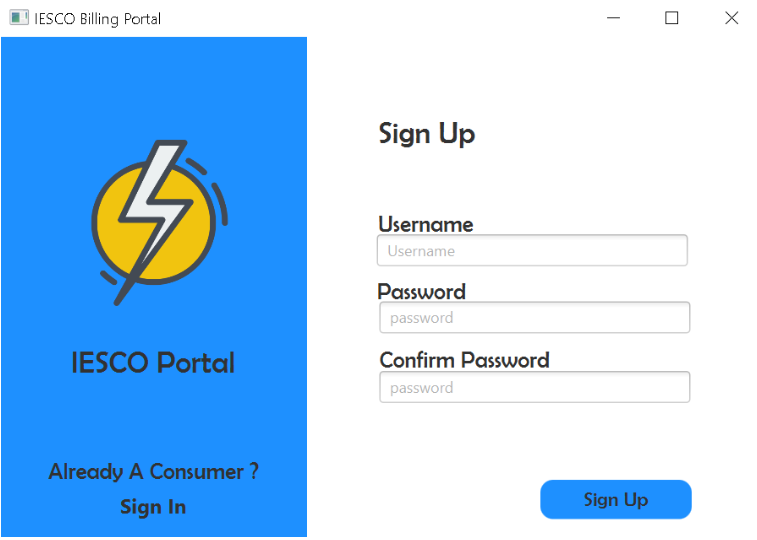]
[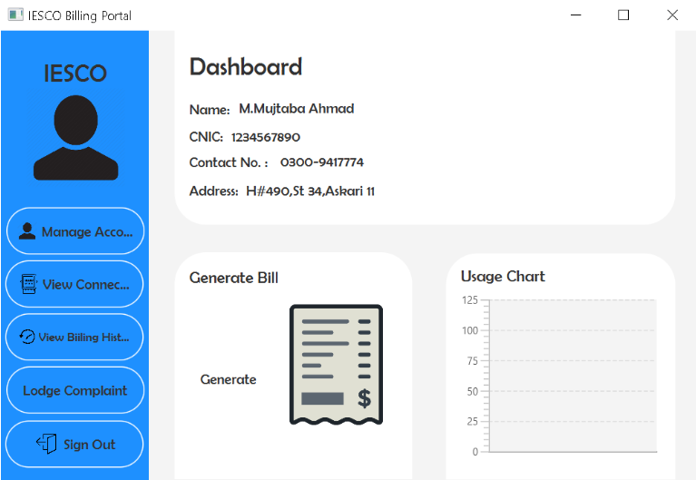]
[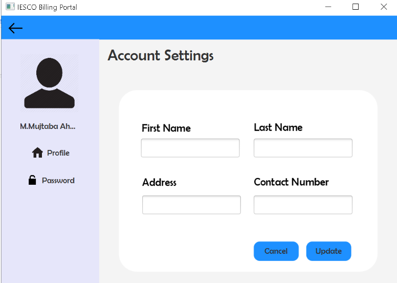]
[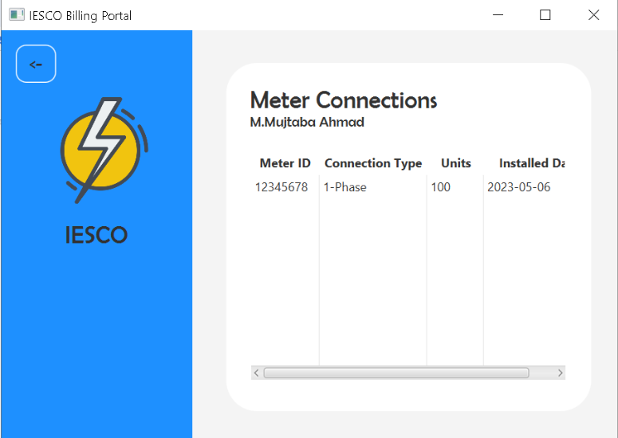]
[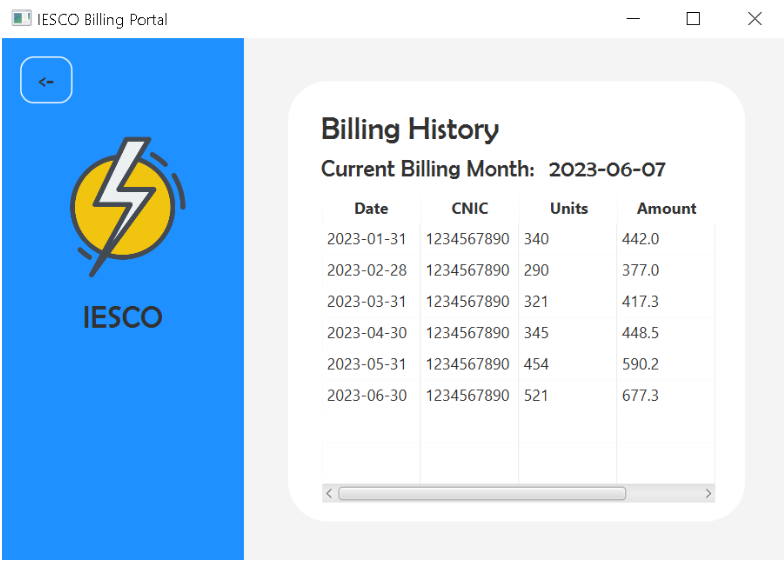]
[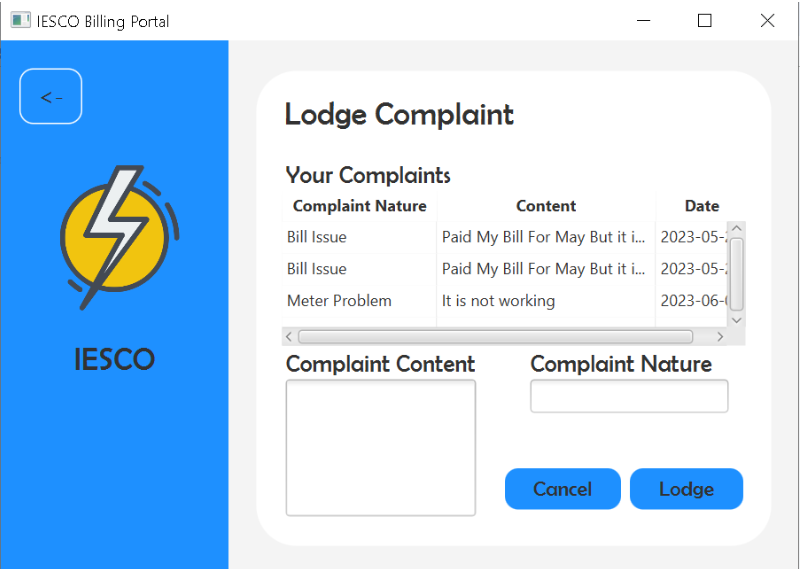]
[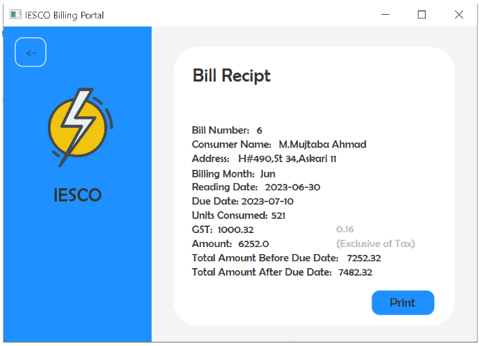]
[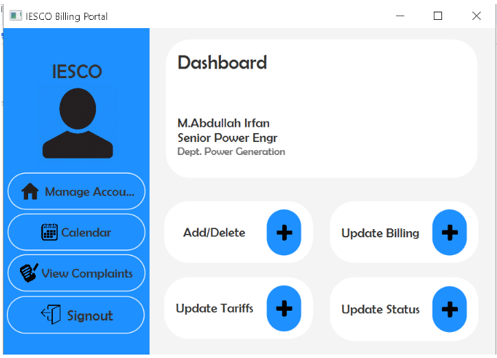]
[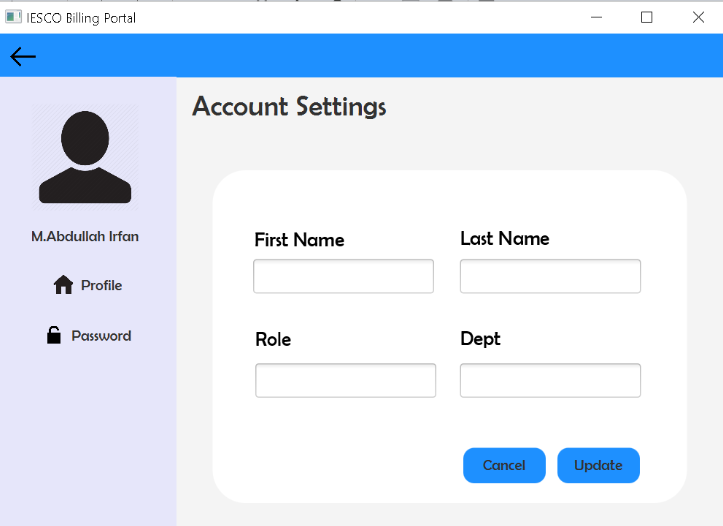]
[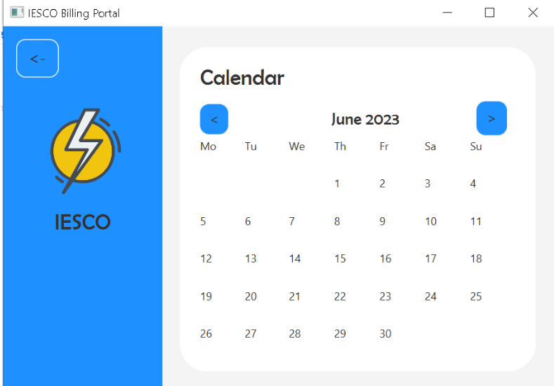]
[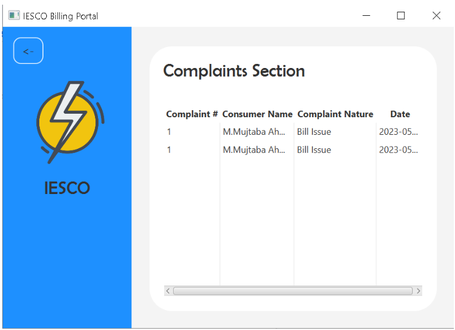]
[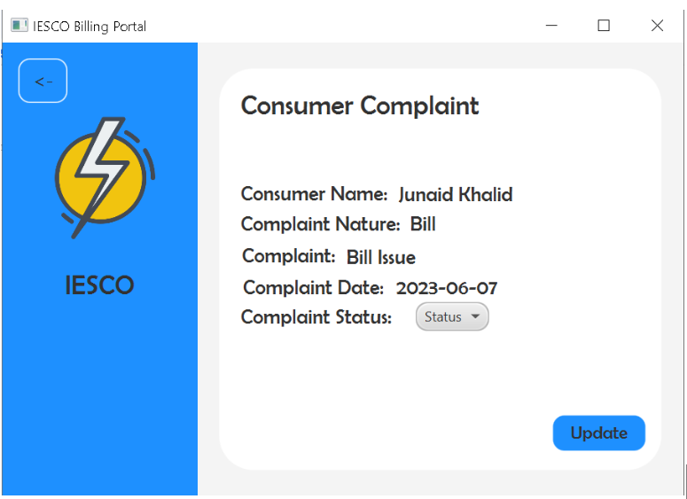]
[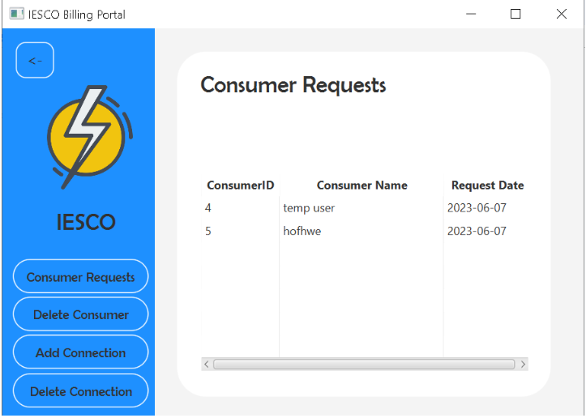]
[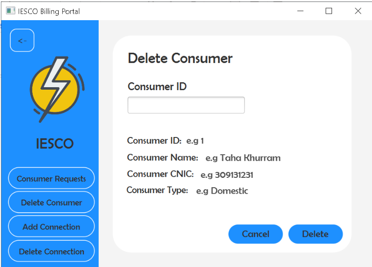]
[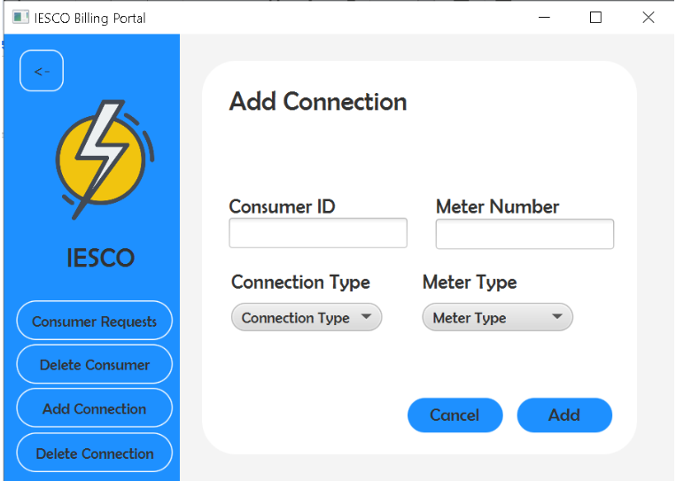]
[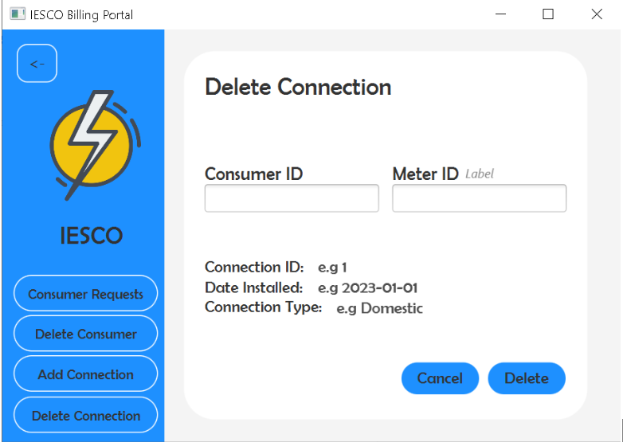]
[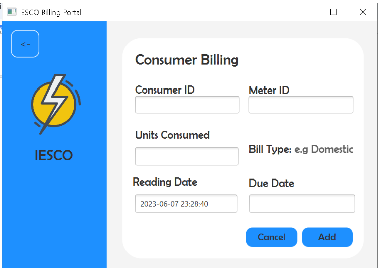]
[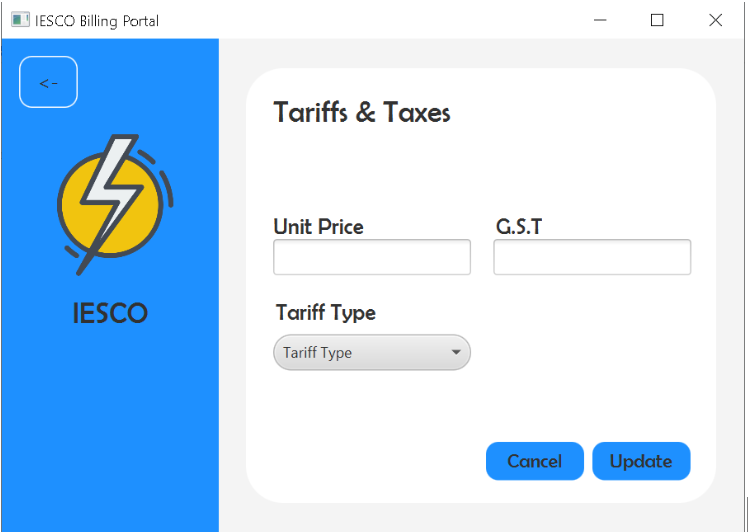]
[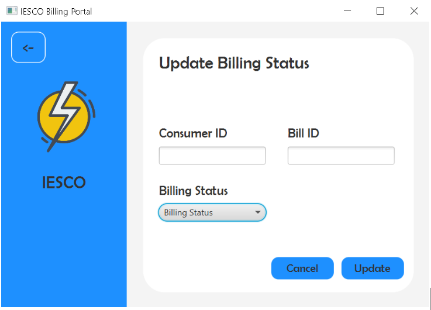]
